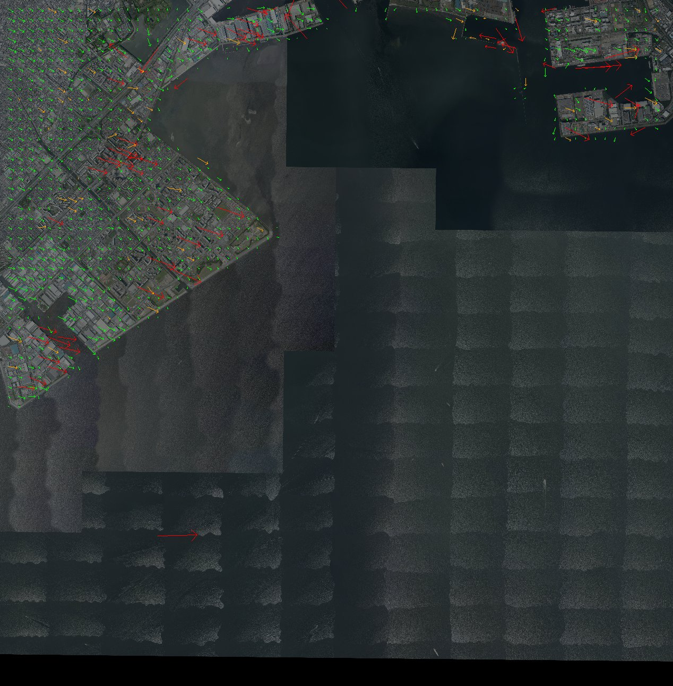
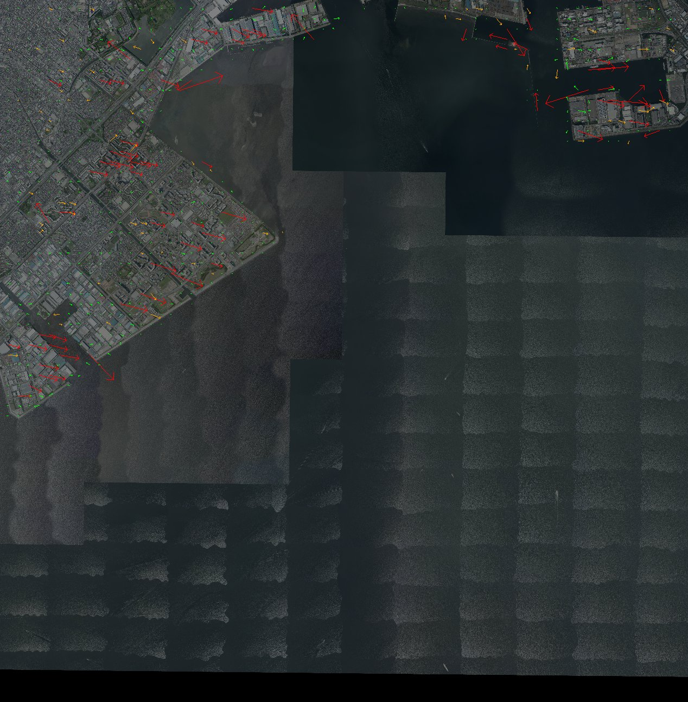
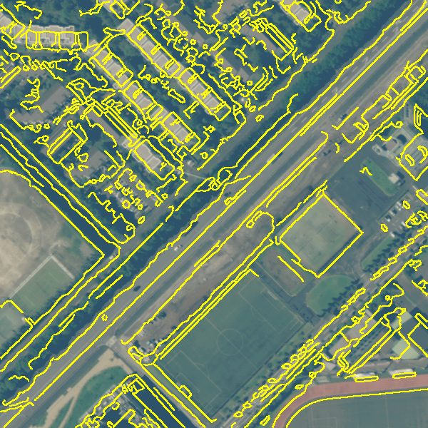
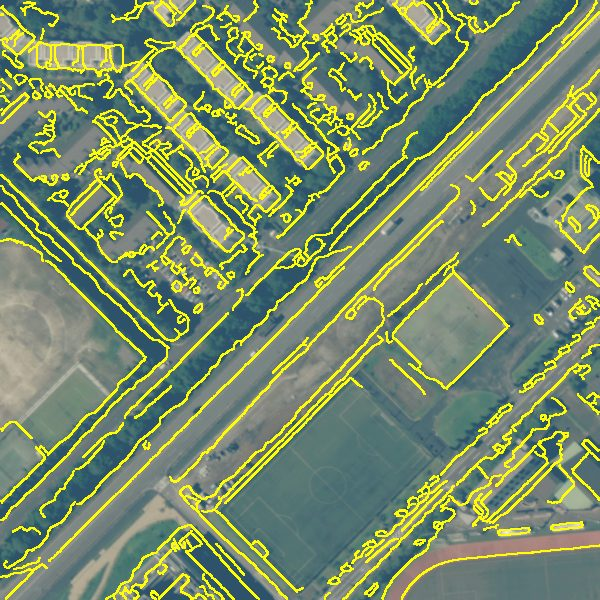
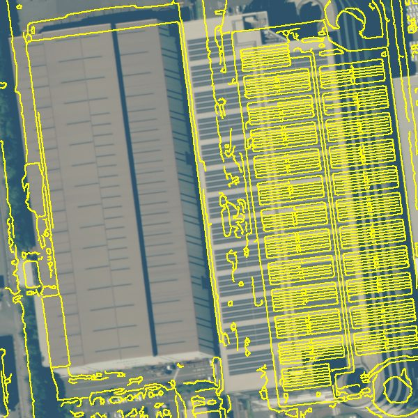
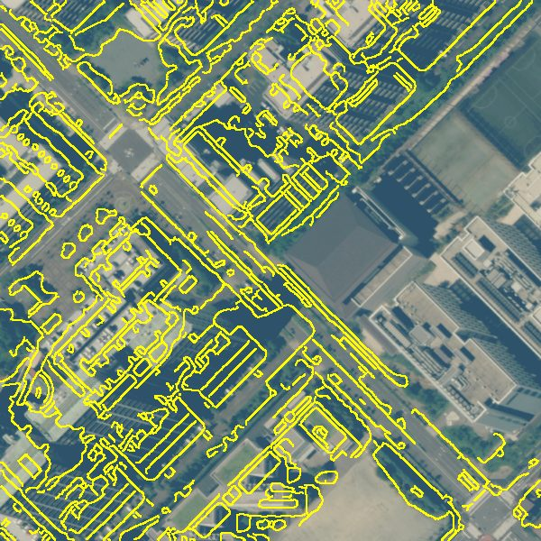
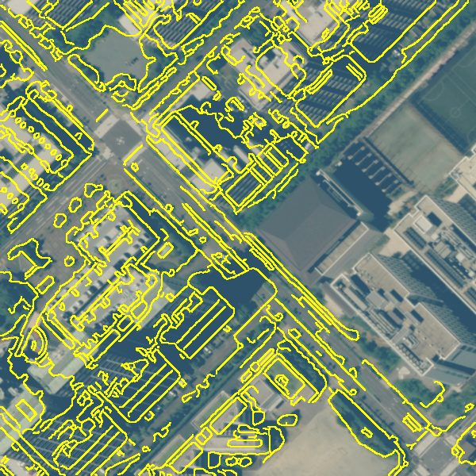

# satcoreg

内閣官房が公開している「令和8年台風25号による千葉県の浸水に関する加工処理画像」（[G空間情報センター dataset/25](https://www.geospatial.jp/ckan/dataset/25)）を、地理院タイルのシームレス空中写真に合わせ込むツールです。

## 前提と限界

配布画像はオルソ化されておらず、RPC（センサモデル）も付いていません。そのため厳密なオルソ化はできません。このツールは、参照写真とのずれを格子状に測ってなめらかな変位場をつくり、画像を引き直す「幾何補正（co-registration）」を行います。

- 平坦地では、地図との位置ずれが数 m から 1〜2 m 程度まで小さくなります。
- 高層建物や高架橋の倒れ込みは消えません。倒れ込みの大きい窓は、外れ値として自動で除いています。
- 水面だけの範囲ではタイポイントが取れません。その範囲の補正は、周囲の点から内挿・外挿した値になります。

## 処理の流れ

1. 対象画像を作業解像度（既定 1 m）に縮小して読み込みます。
2. 同じグリッドに、地理院タイル seamlessphoto（既定ズーム17）をモザイクして参照画像をつくります（`reference.tif`）。
3. 150 m 間隔の格子点ごとに、256 m 四方の窓で位相相関をとり、ECC でサブピクセルまで詰めてずれを求めます。
4. 外れ値を除きます。除く条件は、応答値や相関係数が低いもの、全体の中央値から大きく外れたもの、近傍8点の中央値から外れたものです。
5. 残った点の補正量を薄板スプライン（平滑化あり）で補間し、元の 0.4 m グリッドのまま画像を引き直して、COG で出力します。
6. 出力をもう一度参照画像と照合し、残差を `verify_summary.json` に記録します。

AROSICS（COREG_LOCAL）と同じ考え方ですが、AROSICS は GDAL の Python バインディングが必要で、Windows では uv で入れられません。そのため rasterio と OpenCV で実装しています。

## 結果（5339K4、2026-10-01 撮像）

浦安〜東京湾の図郭で試した結果です（既定パラメータ）。

| | 中央値 | 90パーセンタイル | 最大 | 採用点 |
| --- | --- | --- | --- | --- |
| 補正前のずれ | 5.35 m | 9.92 m | 19.4 m | 702 / 1,044 |
| 補正後の残差 | 1.00 m | 2.83 m | 11.5 m | 693 / 1,044 |

補正前は、全体に東へ約 4 m、南へ約 3 m ずれていました。補正後は、東西・南北のずれの中央値がどちらも約 0 m です。
交差検証で TPS の平滑化を選んだときの誤差（中央値 約 1.4 m）が、点ごとの測定ばらつきの下限の目安です。

| 補正前のずれ | 補正後の残差 |
| --- | --- |
|  |  |

図の見方：矢印はずれの向きと大きさで、長さは実際のずれの 10 倍に描いています。緑は採用した点、橙は近傍判定で除いた点、赤は全体判定で除いた点です。図は `scripts/plot_tiepoints.py` で作成しました。
背景：[地理院タイル（シームレス空中写真）](https://maps.gsi.go.jp/development/ichiran.html)を加工して作成しました。

左側の高層住宅地で目立つ長い赤い矢印は、建物の倒れ込みによるずれです。地表の補正には使わないよう除いています。

### 補正前後の比較

黄色の線は参照写真から抽出したエッジです。衛星画像の地物と重なっていれば、位置が合っています。各画像は 300 m 四方です。

| 地点 | 補正前 | 補正後 |
| --- | --- | --- |
| 市街地と運動場 |  |  |
| 臨海部の工業地帯 |  |  |
| 高層住宅地 |  |  |

高層住宅地では、地表の道路は合っています。ただし高層棟の屋上は倒れ込んで写るため、補正後もずれて見えます。これはオルソ化していない画像では残る差です。

出典：「令和８年台風25号による千葉県における豪雨に関する情報収集衛星画像に基づく加工処理画像」（内閣官房、[G空間情報センター](https://www.geospatial.jp/ckan/dataset/25)）をもとに、satcoreg で幾何補正・切り出し・エッジの重ね描きを行って作成しました。
参照写真のエッジは、[地理院タイル（シームレス空中写真）](https://maps.gsi.go.jp/development/ichiran.html)を加工して作成しました。

## 使い方

```bash
uv sync

# 一覧とダウンロード（撮像日や図郭で絞り込めます）
uv run satcoreg list --date 20261001
uv run satcoreg download --mesh 5339K4 --date 20261001

# タイポイント抽出 → 補正 → 検証
uv run satcoreg run data/raw/5339K4_20261001_54N.tif

# 複数図郭をまとめて処理
uv run satcoreg run data/raw/*.tif
```

`match` と `warp` は別々にも実行できます。
`data/out/<画像名>/` に次のファイルを出力します。

| ファイル | 内容 |
| --- | --- |
| `reference.tif` | 作業グリッド上の参照写真 |
| `tiepoints.geojson` | タイポイント（`status`、補正量 `de`/`dn` [m]、`use`） |
| `match_summary.json` | 補正前のずれの統計 |
| `<画像名>_coreg.tif` | 補正済み画像（COG、元と同じ UTM54N・0.4 m） |
| `verify.geojson` / `verify_summary.json` | 補正後の残差 |

### 点を手で直すとき

`tiepoints.geojson` を QGIS で開いて編集し、`satcoreg warp` を再実行します。

- 点を使わないときは、`use` を 0 にします。
- 点を足すときは、**対象画像上の地物の位置**に点を置きます。そのうえで `de` と `dn` に、地図上の正しい位置までのずれ（m、東向きと北向きが正）を入れ、`use` を 1 にします。

## 開発

```bash
uv run pytest
uv run ruff check . && uv run ruff format .
```

## 利用条件

元画像（内閣官房の加工処理画像）の利用は、[内閣官房ホームページの利用ルール](https://www.cas.go.jp/jp/tyosakuken/index.html)（公共データ利用規約 第1.0版、PDL1.0）に従います。補正した画像を公開・配布するときは、出典に加えて、加工したことと加工した主体を明記してください。参照に使っている地理院タイルは、[国土地理院コンテンツ利用規約](https://www.gsi.go.jp/kikakuchousei/kikakuchousei40182.html)に従います。
